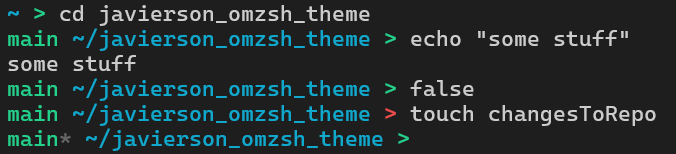

# javierson - Zsh Theme

🗣️🗣️🗣️ This 👆 is a theme 🤑 for oh-my-zsh 😱 I made because I like my terminal looking like this 🔥💯 and I upload it to avoid losing it 😭. If you also like your terminal looking like this 😎, feel free to use it 🤙. But if you don't😢, there are other themes available (not here 😡 but there are 😊).

## Features

- Git Status Display: Displays the current Git branch and an indicator (*) when there are uncommitted changes. 
- Git Info: The Git branch and status are integrated directly into the prompt.
- Path: you can see path 👍
- Custom Prompt Arrow: The arrow color changes based on the exit status of the last command. Green for success, red for failure.

## How does it look?
Like this:



## Installation
1. Clone the theme into your custom themes directory (or just download the theme file):
```bash
git clone https://github.com/yourusername/javierson.git 
```


2. Move `.zsh-theme` into your custom themes directory. Something like this:
```bash
mv javierson.zsh-theme $ZSH_CUSTOM/themes/javierson
```

3. Edit your `~/.zshrc` file to use the new theme by updating the `ZSH_THEME` variable:
```bash
ZSH_THEME="javierson"
```

4. Reload your shell configuration by running:
```bash
source ~/.zshrc
```

Now you should have this theme installed👍🗣️.